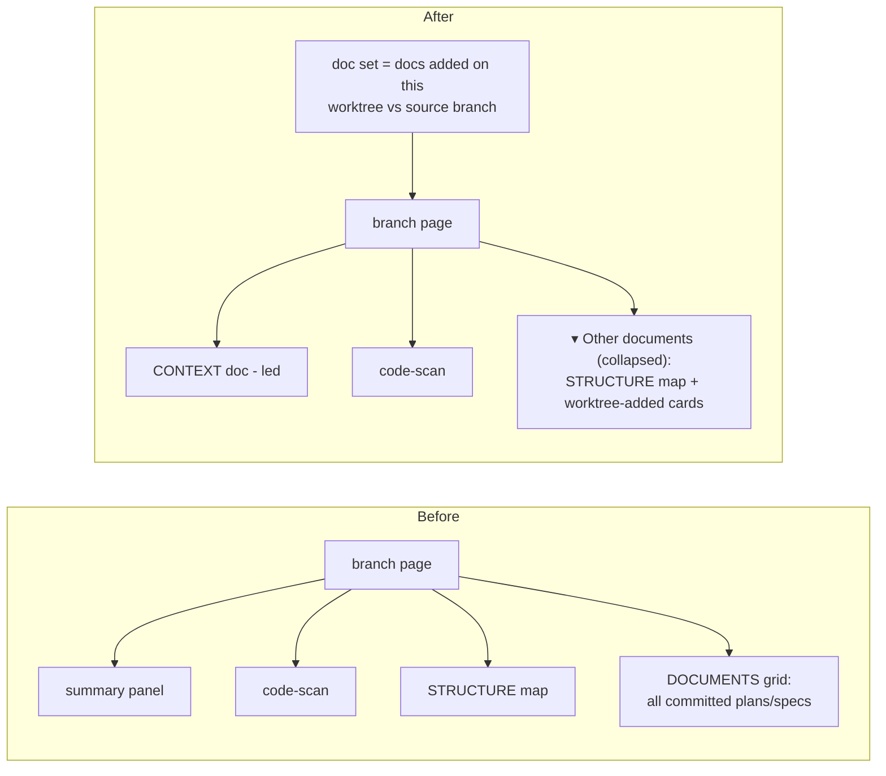

# Worktree-scoped doc rendering

## Context summary

doc-server runs one shared server that registers every project and branch into a
single home. Each branch lands at `/<project>/<branch>/` and its page is built by
`sync_target`, which globs `docs/**/*.md` and lays every committed doc out as an
equal "DOCUMENTS" card.

Because `docs/` is committed to the repo, every worktree inherits the *entire*
accumulated history of plans and specs — including ones from unrelated past work.
A worktree on `feat/login` sees the same doc pile as every other branch, so its
own current task is buried in noise.

The goal: a worktree page should show **only the docs this worktree introduced**
(relative to its source branch), foreground the **single context document** the
agent maintains for its current task, and hide the accumulated plans/specs that
already live on the source branch. The global sidebar — which lists every project
and worktree — stays exactly as it is.

## The solution

Two filters working together:

1. **Doc set** — restrict the worktree's docs to those *added on this worktree*
   relative to its source branch (committed and uncommitted alike). Docs that
   already exist on the source branch are not shown at all.
2. **Promotion** — within that set, promote the agent-designated context doc to a
   lead panel and demote the rest into a collapsed section.

### 0. Doc set = docs this worktree introduced

A doc is "this worktree's" if it does **not** exist on the source branch:

- **Source branch resolution** — prefer the branch's tracked upstream
  (`git rev-parse --abbrev-ref @{upstream}`); fall back to the git fork-point
  against the repo default branch (`git merge-base --fork-point`), then a plain
  `merge-base` against the default branch.
- **Added & committed** — new files in `git diff --diff-filter=A <base>...HEAD`,
  filtered to the docs glob.
- **Added & uncommitted** — untracked / newly-staged files from
  `git status --porcelain`, filtered to the docs glob.
- The union of those two sets is what the branch page renders.

**Fallbacks:** if no source branch can be resolved (e.g. the worktree *is* the
default branch, or it's not a git repo / has no fork-point), the page renders the
full docs glob as it does today — no regression for the main checkout.

### 1. Designating the context doc

Resolution order:

1. **Explicit** — the agent passes `--context <path>` to `serve.py`. The path is
   stored as a `context` field on the registry entry via
   `state.register_target`.
2. **Frontmatter fallback** — a doc with frontmatter `worktree_context: true`.
3. **Backward-compatible aliases** — the existing `worktree-summary.md` filename
   and `worktree_summary: true` frontmatter continue to work.

Internally the "summary" concept is renamed to "context"; the old triggers remain
as aliases so existing setups keep working.

### 2. Context-first branch layout

```
┌─ hero (branch name, live badge) ──────────────┐
│ ▸ CONTEXT   ← the agent's context doc, led     │
│   (summary → solution → before/after → plans)  │
│ ▸ OVERVIEW & ARCHITECTURE (auto code-scan)     │
│ ▾ Other documents (N)  ← collapsed <details>   │
│     STRUCTURE map + the doc cards live here     │
└────────────────────────────────────────────────┘
```

- The context doc leads; its full render stays one click away (every doc is still
  rendered to its own HTML page).
- The auto code-scan (overview / architecture / external services) stays in the
  lead area — it is compact project context, not doc-pile noise.
- The remaining **worktree-added** docs are demoted into a collapsed `<details>`
  titled **"Other documents (N)"**, together with the structure map. Docs that
  live on the source branch never appear here — they're filtered out upstream.

**Demotion rule:** demotion only applies when a context doc exists *and* the
worktree-added doc set is non-empty. When the doc set falls back to the full glob
(default branch / no fork-point), the page renders exactly as it does today — no
regression.

### 3. Global sidebar

Unchanged. Every project and worktree stays listed; the change only affects what
the branch *page body* foregrounds.

## Before & after



## Plans

Changes, roughly in dependency order:

1. **Source-branch resolution + worktree-doc filter** — a helper (in `identity.py`
   or a small `gitscope.py`) that resolves the source branch (upstream →
   fork-point → default-branch merge-base) and returns the set of worktree-added
   doc paths (committed `--diff-filter=A` ∪ untracked from `git status`). Returns
   `None` when no source branch resolves, signalling "show all".
2. **`state.py`** — `register_target` accepts and persists an optional `context`
   path on the registry entry.
3. **`serve.py` / `app.py`** — add `--context <path>` flag, thread it through
   `bring_up` into `register_target`.
4. **`sync.py`**
   - In `sync_target`, filter `find_docs` through the worktree-doc set (skip the
     filter when it returns `None`).
   - Rename `is_summary_doc` → `is_context_doc`; check the registry-designated
     path first, then `worktree_context: true`, then the legacy
     `worktree-summary.md` / `worktree_summary: true` aliases.
   - In `render_branch_index`, when a context doc exists: keep the lead panel +
     code-scan up top, and wrap STRUCTURE + DOCUMENTS in a collapsed
     "Other documents (N)" `<details>`. When none exists, render as today.
5. **`SKILL.md` + session-start hook** — nudge the agent to write the structured
   context doc (context summary → solution → before/after flowchart → plans) and
   pass `--context`.
6. **Tests** — cover source-branch resolution + the doc filter (added/untracked
   vs. source-branch docs, plus the show-all fallback), context-doc resolution
   order, and the demotion rule.

## Out of scope

- Per-request "which worktree am I" detection — the URL/branch already identifies
  it; no new server-side request scoping needed.
- Changing the global sidebar or root/project landing pages.
- Showing *modified* (vs. newly-added) docs as worktree docs — only files that do
  not exist on the source branch count; edits to source-branch docs stay hidden.
- A dedicated-folder convention for worktree docs (considered and dropped in favor
  of the git-diff doc set plus the agent-maintained context doc).
