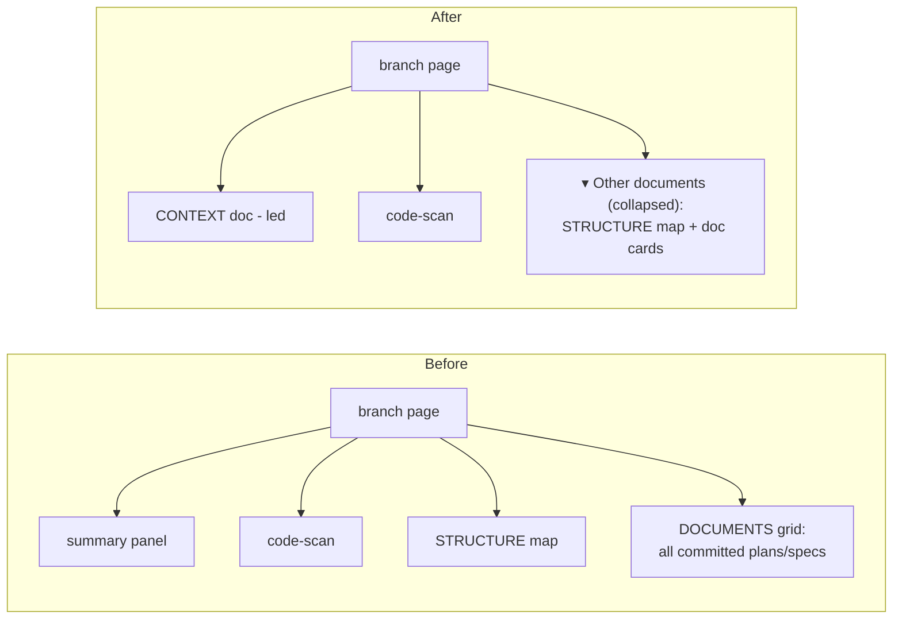

# Worktree-scoped doc rendering

## Context summary

doc-server runs one shared server that registers every project and branch into a
single home. Each branch lands at `/<project>/<branch>/` and its page is built by
`sync_target`, which globs `docs/**/*.md` and lays every committed doc out as an
equal "DOCUMENTS" card.

Because `docs/` is committed to the repo, every worktree inherits the *entire*
accumulated history of plans and specs — including ones from unrelated past work.
A worktree on `feat/login` sees the same doc pile as every other branch, so its
own current task is buried in noise.

The goal: a worktree page should foreground the **single context document** the
agent maintains for its current task, and demote the accumulated plans/specs so
they no longer compete. The global sidebar — which lists every project and
worktree — stays exactly as it is.

## The solution

Turn the existing "summary doc → lead panel" promotion into the organizing
principle of the branch page, and let the agent explicitly designate which doc is
the context doc.

### 1. Designating the context doc

Resolution order:

1. **Explicit** — the agent passes `--context <path>` to `serve.py`. The path is
   stored as a `context` field on the registry entry via
   `state.register_target`.
2. **Frontmatter fallback** — a doc with frontmatter `worktree_context: true`.
3. **Backward-compatible aliases** — the existing `worktree-summary.md` filename
   and `worktree_summary: true` frontmatter continue to work.

Internally the "summary" concept is renamed to "context"; the old triggers remain
as aliases so existing setups keep working.

### 2. Context-first branch layout

```
┌─ hero (branch name, live badge) ──────────────┐
│ ▸ CONTEXT   ← the agent's context doc, led     │
│   (summary → solution → before/after → plans)  │
│ ▸ OVERVIEW & ARCHITECTURE (auto code-scan)     │
│ ▾ Other documents (N)  ← collapsed <details>   │
│     STRUCTURE map + the doc cards live here     │
└────────────────────────────────────────────────┘
```

- The context doc leads; its full render stays one click away (every doc is still
  rendered to its own HTML page).
- The auto code-scan (overview / architecture / external services) stays in the
  lead area — it is compact project context, not doc-pile noise.
- The remaining docs (plans, specs, everything else) are demoted into a collapsed
  `<details>` titled **"Other documents (N)"**, together with the structure map.

**Demotion rule:** demotion only applies when a context doc exists. A branch with
no context doc renders exactly as it does today — no regression.

### 3. Global sidebar

Unchanged. Every project and worktree stays listed; the change only affects what
the branch *page body* foregrounds.

## Before & after



## Plans

Changes, roughly in dependency order:

1. **`state.py`** — `register_target` accepts and persists an optional `context`
   path on the registry entry.
2. **`serve.py` / `app.py`** — add `--context <path>` flag, thread it through
   `bring_up` into `register_target`.
3. **`sync.py`**
   - Rename `is_summary_doc` → `is_context_doc`; check the registry-designated
     path first, then `worktree_context: true`, then the legacy
     `worktree-summary.md` / `worktree_summary: true` aliases.
   - In `render_branch_index`, when a context doc exists: keep the lead panel +
     code-scan up top, and wrap STRUCTURE + DOCUMENTS in a collapsed
     "Other documents (N)" `<details>`. When none exists, render as today.
4. **`SKILL.md` + session-start hook** — nudge the agent to write the structured
   context doc (context summary → solution → before/after flowchart → plans) and
   pass `--context`.
5. **Tests** — cover context-doc resolution order and the demotion rule
   (present vs. absent).

## Out of scope

- Per-request "which worktree am I" detection — the URL/branch already identifies
  it; no new server-side request scoping needed.
- Changing the global sidebar or root/project landing pages.
- Filtering docs by git diff or dedicated folders (considered and dropped in favor
  of the agent-maintained context doc).
