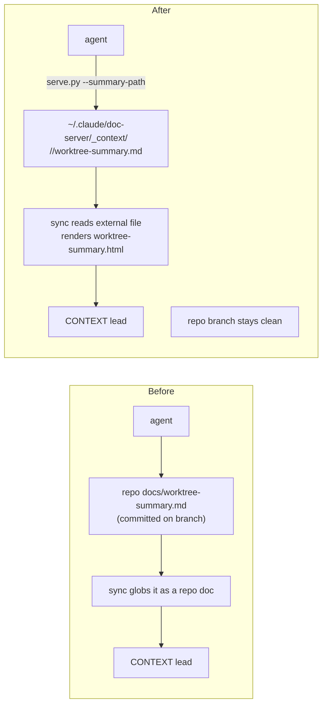

# External worktree summary

## Context summary

The worktree context/summary doc currently lives in the project repo at
`docs/worktree-summary.md` (committed on the branch). That pollutes the project
branch with a file that is *about* the agent's work rather than part of the
project, and it gets caught in the repo's history and diffs.

This change moves the summary out of the repo into doc-server's own home, keyed
per project and branch, so it never touches the project tree. The agent writes
and updates it there; the server renders it as the lead **CONTEXT** panel.

## The solution

### Storage — a dedicated, non-disposable source area

The source summary lives at:

```
~/.claude/doc-server/_context/<project>/<branch>/worktree-summary.md
```

`_context/` is a sibling of the generated `<project>/<branch>/` HTML dirs. It is
never touched by the `.html` stale-cleanup in `sync_target` (which only unlinks
top-level `*.html`) nor by `--migrate` (which rmtrees only the generated project
dirs). Summaries therefore survive HTML regeneration and migration.

### Writing it — `serve.py --summary-path`

A new flag resolves the cwd's identity (project + branch), ensures the
`_context/<project>/<branch>/` directory exists, prints the absolute path to
`worktree-summary.md`, and exits. The agent writes the structured markdown there
with normal file tools, then re-serves. No content is piped through the CLI.

The recommended summary structure is unchanged: context summary → solution →
before/after Mermaid flow → plans.

### Rendering — server reads the external file

During `sync_target` for a branch, the server checks for the external summary at
the resolved `_context` path. If present:

- It is rendered to `worktree-summary.html` in the branch's generated dir, using
  the same markdown/Mermaid renderer as repo docs.
- It becomes the lead **CONTEXT** panel; its `href` points at that page.
- `worktree-summary.html` is added to the kept-files set so stale-cleanup does
  not delete it.

The external summary is **not** subject to the worktree-added doc filter (it
lives outside the repo and is merged in separately). The in-repo doc set still
filters exactly as today.

### Lead-context resolution order

1. **External summary file** (`_context/<project>/<branch>/worktree-summary.md`).
2. **`--context <path>`** — an in-repo doc the agent designates (e.g. the spec).
3. **In-repo fallback** — frontmatter `worktree_context: true`, then the legacy
   `worktree-summary.md` filename / `worktree_summary: true`.

The external file wins when present; in-repo detection only runs when it is
absent.

### Repo cleanup

Delete the committed `docs/worktree-summary.md`. For this very worktree (the
dogfood case), its content moves to the external location.

## Before & after



## Plans

Changes, in dependency order:

1. **Path resolver** — a helper that, given `home`, `project`, `branch`, returns
   the `_context/<project>/<branch>/worktree-summary.md` path (in `state.py` or a
   small helper). Used by both `serve.py --summary-path` and `sync_target`.
2. **`serve.py --summary-path`** — resolve identity, mkdir the `_context` dir,
   print the absolute path, exit (no server work).
3. **`sync.py`** — in `sync_target`, before in-repo context detection: if the
   external summary exists, render it to `worktree-summary.html`, build the
   `context` dict from it, add it to `current_flats`, and skip in-repo detection.
   In-repo `is_context_doc` resolution runs only when no external file exists.
4. **`SKILL.md` + session hook** — document `--summary-path` and the external
   convention; nudge the agent to write the summary there, not in the repo.
5. **Repo cleanup** — delete `docs/worktree-summary.md`; seed this worktree's
   external summary with the same content.
6. **Tests** — path resolution; `--summary-path` output + dir creation; external
   summary rendered as the lead and not deleted by stale-cleanup; precedence
   (external wins over `--context` and in-repo aliases); the in-repo fallback
   still works when no external file exists.

## Out of scope

- Auto-deriving the summary content from project docs — the agent still authors
  it.
- Storing other doc types (specs, plans) externally — only the worktree summary
  moves; those stay in the repo and flow through the worktree-added filter.
- Changing the global sidebar or the worktree-added doc-set logic.
