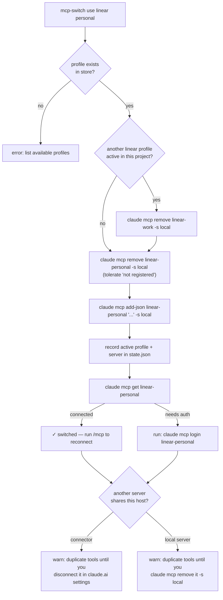

# mcp-switch — per-project MCP profile switcher

## Context summary

One provider, several accounts. Linear has a work workspace and a personal one;
Notion, Sentry and Retell have the same shape. Today the only way to move
between them is to reconnect the provider by hand — find the connector, log out,
log back in against the other account — and every project on the machine moves
with you, because the connection is account-level.

What we want instead: named profiles per provider, stored per project, switched
with one command.

Two facts about the current machine set the constraints:

- **The live Linear server is a claude.ai account connector**
  (`https://mcp.linear.app/mcp`). Connectors are managed in claude.ai settings,
  not on disk, so no local tool can repoint one at a different workspace. The
  switcher therefore works with *locally registered* HTTP servers added through
  `claude mcp add-json`, which sit alongside connectors rather than replacing
  them.
- **OAuth credentials are keyed per server name.** Two profiles registered under
  the same name cannot both stay authenticated — the second login overwrites the
  first. Profiles must own distinct server names for a switch to be instant.

## The solution

### Store — profiles live outside the repo, keyed on the main repo

```
~/.claude/mcp/<project>/
  state.json          # active profile per provider, keyed by project root
  linear/
    work.json         # {"server": "linear-work", "transport": "http",
                      #  "url": "https://mcp.linear.app/mcp"}
    personal.json
  notion/
    acme.json
```

`<project>` is the **main repository's directory name** — the parent of
`git rev-parse --git-common-dir` — so every linked worktree of a repo resolves to
the same store. This repo resolves to `skills` from any of its worktrees, the
same project key `doc-server` already uses. Define a profile once, use it from
any worktree.

Profile files are plain JSON, hand-editable, and hold exactly what
`claude mcp add-json` needs plus the server name. `server` defaults to
`<provider>-<profile>` when omitted.

### Activation — per project

A switch writes the chosen profile into **local scope**
(`claude mcp add-json <server> '<json>' -s local`). Claude Code files that under
the **main repository root**, not the working directory: a registration made
from a subdirectory or from a linked worktree lands under the same project key
as one made from the repo root. So activation is per project — one live profile
per provider per repository — and every worktree of a repo shares it. Keying
state any other way would leave two profiles' servers registered side by side
under one project, which is exactly the duplicate-account hazard this exists to
prevent.

`state.json` therefore uses the same key the CLI does, the main repo root, and
records the server name that was registered so deactivation never has to guess
it back from a profile that may since have been deleted:

```json
{"/Users/me/work/repo": {"linear": {"profile": "work", "server": "linear-work"}},
 "/Users/me/work/other": {"notion": {"profile": "acme", "server": "notion-acme"}}}
```

### Switch flow



Removing a server is not the same as logging out — `claude mcp logout` is a
separate command — so a previously authenticated profile is expected to come
back authenticated. That expectation is **not assumed**: every switch verifies
with `claude mcp get` and, when auth is missing, prints the exact `login`
command. The worst case is one browser round-trip; the switch never silently
leaves a dead server behind.

### Commands

| Command | Behaviour |
|---|---|
| `list [provider]` | Providers → profiles, which is active in this project, auth status per profile |
| `use <provider> <profile>` | The flow above |
| `save <provider> <profile> --from <server> [--server <name>]` | Capture an already-configured server into the store |
| `add <provider> <profile> --url <url> [-H k:v] [--transport http\|sse]` | Define a profile from scratch |
| `add <provider> <profile> --json '<json>'` | Same, for stdio servers or anything unusual |
| `rm <provider> <profile>` | Delete from the store; never touches OAuth credentials |

`use` is the hot path and the only one the skill needs for day-to-day work. It
is idempotent: `claude mcp add-json` refuses a name that already exists, so the
target server name is always removed before it is added, and that removal is
allowed to fail. Re-selecting the active profile re-registers it cleanly, and so
does `use` straight after `save`, where the server is registered already.

### The duplicate-host warning

After a successful switch, the skill compares the profile's URL host against the
hosts in `claude mcp list`. Another server on the same host means two sets of
the provider's tools are live at once, with no way to tell from a tool name
which account answers. The skill prints a one-line warning naming it. Connectors
are listed as `claude.ai <Name>` and can only be disconnected in claude.ai
settings, so that is what the warning says for them; any other server is local,
and the warning offers `claude mcp remove <name> -s local` instead. It disables
nothing itself.

### Reconnecting

MCP servers are loaded when a session starts. A switch changes configuration on
disk; the running session keeps the old connection until `/mcp` reconnects it or
the session restarts. Every successful `use` prints this — the skill never
implies the switch is live in the current session on its own.

## Module shape

```
skills/mcp-switch/
  SKILL.md
  switch.py            # CLI entry point — argument parsing, output formatting
  mcpswitch/
    identity.py        # main-repo resolution → store path
    store.py           # read/write profiles + state.json
    cli.py             # the one seam that shells out to `claude mcp …`
    commands.py        # list / use / save / add / rm, on top of store + cli
  tests/
  run_tests.sh
```

`cli.py` is the single place that runs a subprocess. Tests fake it, so the whole
command layer is exercised without touching the machine's real MCP config.

## Testing

Mirrors `doc-server`: `unittest` files run individually by `run_tests.sh`, each
ending in `OK`. Coverage:

- **identity** — a linked worktree and its main checkout resolve to the same
  store name; a non-git directory degrades to the directory's own name.
- **store** — profile round-trip, `server` defaulting to `<provider>-<profile>`,
  state keyed per project root and recording the registered server name,
  malformed JSON surfacing a readable error.
- **commands** — `use` removes the previously active server before adding the
  new one; `use` on the already-active profile still succeeds; `use` on an
  unknown profile errors without mutating anything; a deleted profile is still
  deactivated under the server name recorded for it; auth-missing output names
  the login command; the duplicate-host warning fires only on a host match and
  gives advice that fits the server it names.
- **cli seam** — arguments handed to `claude mcp` are exactly as expected
  (asserted against a fake, never executed).
- **smoke** — the only test that runs the real `claude` CLI, under a temp cwd,
  a temp `MCP_SWITCH_HOME` and a temp `CLAUDE_CONFIG_DIR`: a switch round-trip,
  `use` twice in a row, and activation from a repo root seen from one of its
  subdirectories.

## Out of scope

- Switching claude.ai account connectors. Not possible locally; the skill warns
  and moves on.
- Reading, moving or rewriting stored OAuth credentials. Auth is always the
  provider's own `claude mcp login` flow.
- Auto-reconnecting the running session after a switch.
- Global (user-scope) activation. Everything is local scope by design; a later
  iteration could add `--scope user` behind a flag.
- Two accounts for one provider live in one repository at the same time. Local
  scope is keyed on the main repository root, so the CLI has nowhere to put a
  second one.
