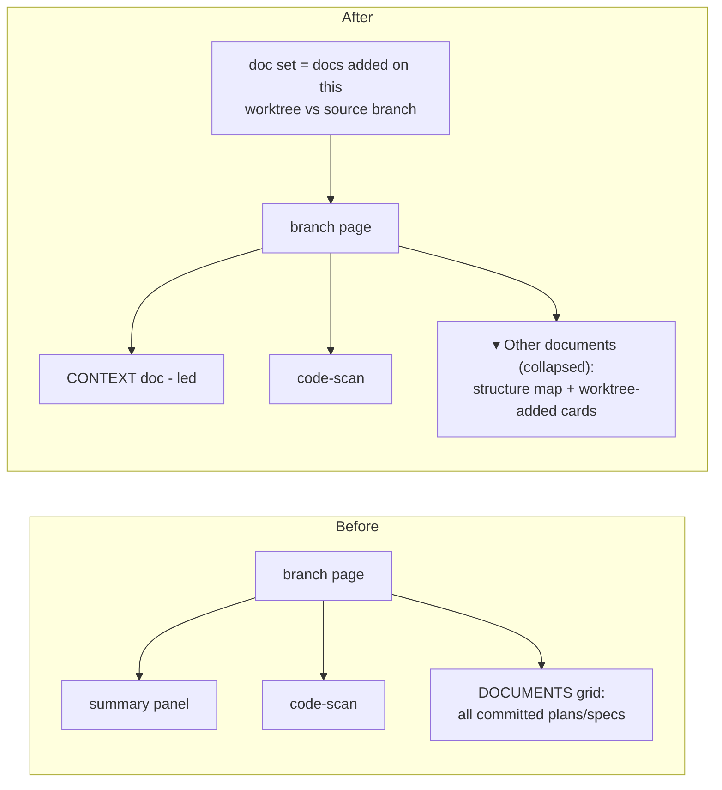

# Worktree: worktree-scoped doc rendering

## Context summary

doc-server runs one shared server and renders every committed doc under
`docs/**/*.md` as an equal card on a branch page. Because `docs/` is committed,
every worktree inherits the *entire* accumulated pile of plans and specs — so a
worktree's own current task is buried in noise from unrelated past work.

This worktree makes a branch page show **only the docs that worktree introduced**
(vs. its source branch) and lead with the agent's single context document. The
global sidebar (every project/worktree) stays unchanged.

## The solution

Two filters working together:

1. **Doc set** — restrict the page to docs *added on this worktree* relative to
   its source branch (resolved via upstream → fork-point → default merge-base),
   counting both committed-added and uncommitted/untracked files. Docs already on
   the source branch are hidden. Falls back to "show all" on the default branch /
   non-git checkout.
2. **Promotion** — the agent designates the lead context doc (via `--context`,
   else `worktree_context: true` frontmatter, else the legacy summary aliases).
   It leads the page; the remaining worktree-added docs are demoted into a
   collapsed "Other documents" section.

## Before & after

## Plans

- **Spec:** [`docs/superpowers/specs/2026-06-28-worktree-scoped-docs-design.md`](superpowers/specs/2026-06-28-worktree-scoped-docs-design.md) — approved.
- **Implementation plan:** [`docs/superpowers/plans/2026-06-28-worktree-scoped-docs.md`](superpowers/plans/2026-06-28-worktree-scoped-docs.md) — 8 TDD tasks: `gitscope.py` → registry `context` → `--context` flag → doc filter → `is_context_doc` → context-first layout → SKILL/hook → full suite.
- **Status:** implemented and reviewed. All 8 plan tasks done via subagent-driven development (TDD); full suite green (14/14); whole-branch review passed after fixing one Critical (pushed-branch base resolution) and aligning the doc filter to the spec's modified-doc exclusion. Manual smoke check confirms the branch page leads with CONTEXT and hides pre-branch docs.
- **Operational note:** a long-running doc-server daemon must be restarted to pick up code changes (Python doesn't hot-reload); the daemon re-syncs content on each request but not its own logic.
