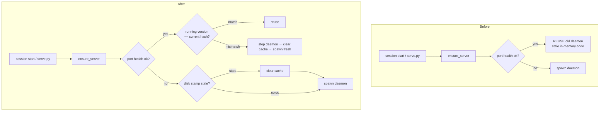

# doc-server: auto-restart the daemon when the skill is updated

## Context

The doc-server runs as a single long-lived background daemon (`serve.py --daemon`).
Once it is up, every new session reuses it via a health probe. The catch: a reused
daemon keeps serving the **code it loaded into memory at startup**. So editing the
skill's Python (`docserver/*.py`, `serve.py`) changed nothing until someone manually
killed the daemon. The generated HTML cache and `.inspect.json` under
`~/.claude/doc-server/` could also be stale relative to the new code.

## Solution

Fingerprint the skill's runtime source and let the daemon advertise that
fingerprint on its health endpoint. On the next `serve.py` / SessionStart run, if the
running daemon's fingerprint differs from the code on disk, the launcher stops the
old daemon, clears the disposable generated cache, and spawns a fresh daemon on the
same port. No manual restart, fully transparent.

- Update signal: **content hash** of `docserver/*.py` + `serve.py` (tests/assets
  excluded, so editing a test never restarts the daemon).
- Cache cleared: per-`<project>/<branch>` HTML dirs + `.inspect.json`. Kept:
  `_assets/` (downloads), `state.json`, `registry.json`.
- Daemon PID + version stamp persisted in `state.json` so the right process is
  killed and stale-cache can be detected even when no daemon is live.

## Flow: before → after

## What changed

- `docserver/version.py` (new) — `code_version()` / `fingerprint()`.
- `docserver/state.py` — `get/set_code_version`, `get/set_daemon_pid`.
- `docserver/server.py` — health advertises `version`; `probe_version`,
  `stop_daemon`, `_spawn_daemon`; `ensure_server` restart/clear logic.
- `docserver/sync.py` — `clear_generated(home)`.
- `SKILL.md` — "Updating the skill" section.
- Tests: `test_version.py`, `test_restart.py`, plus additions to
  `test_state.py`, `test_sync.py`, `test_handler.py`, `test_port.py`.

## Status / next

- All 15 test files green (built test-first).
- Possible follow-ups (out of scope): a lockfile to serialise two sessions racing
  a restart; surfacing "daemon restarted (skill updated)" in the SessionStart
  context line.
