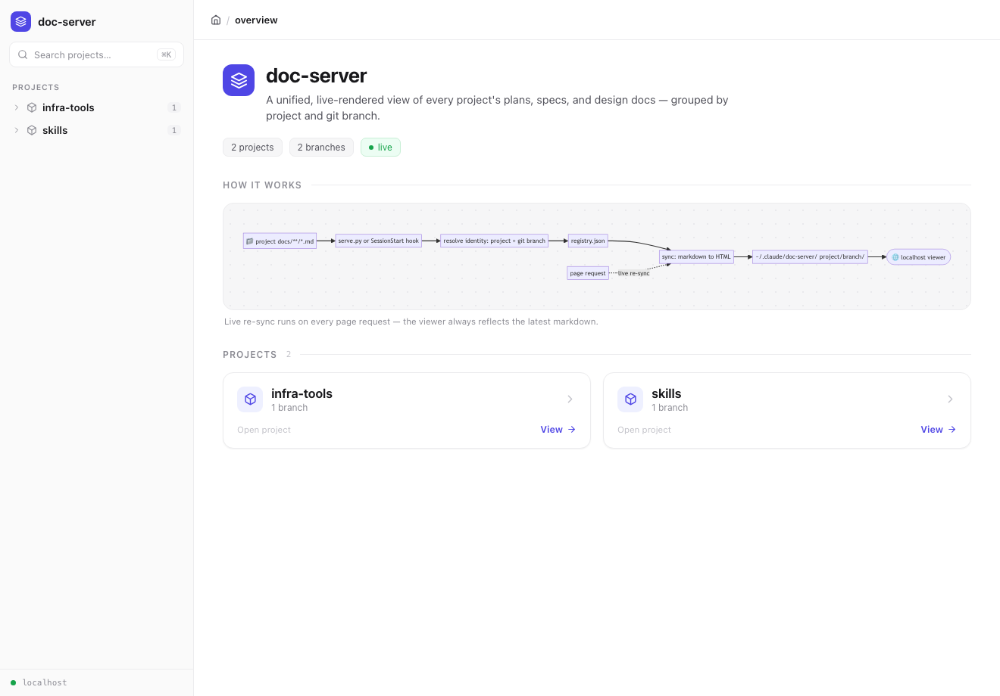
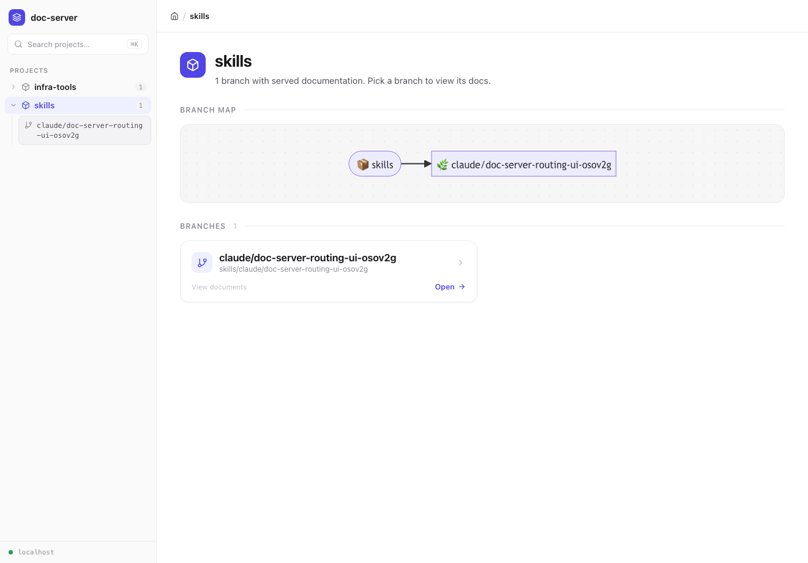
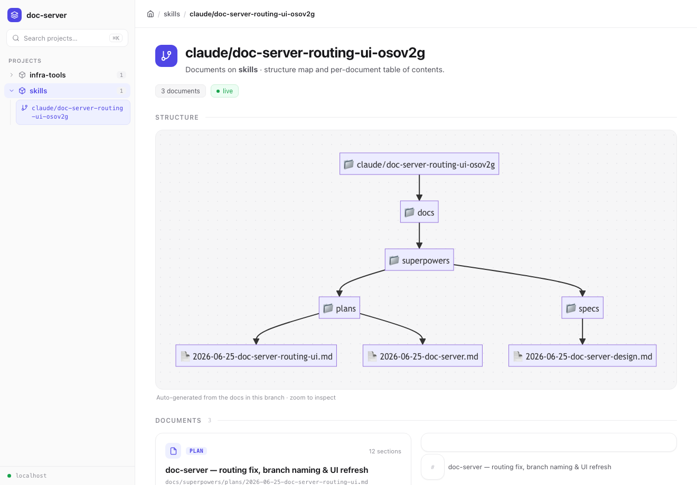
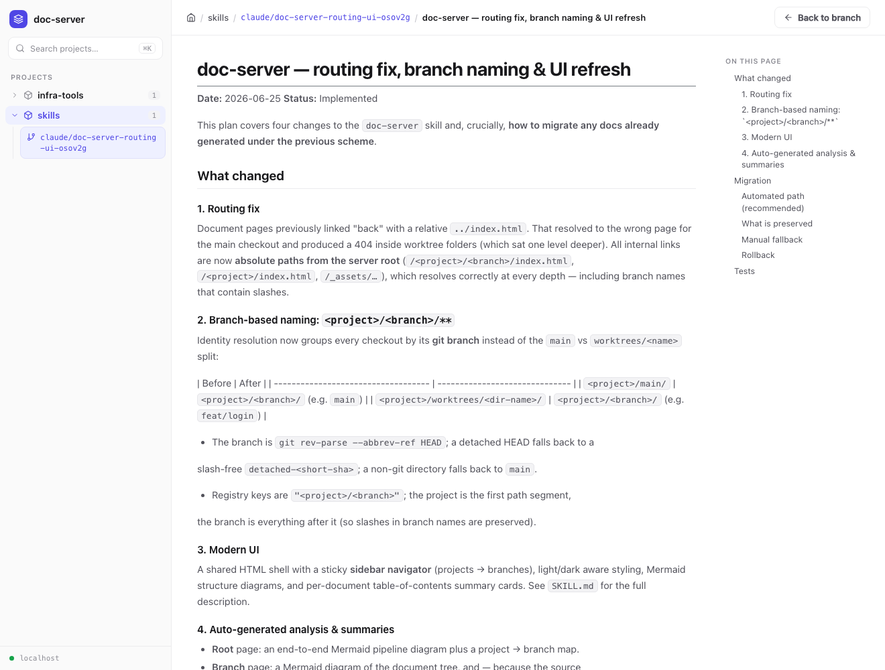
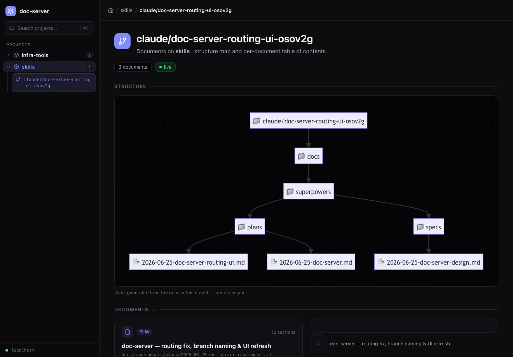

# doc-server

A tiny local web app that serves a project's markdown docs — plans, specs, design
notes — as browsable, rendered HTML on a single shared `localhost` port. An agent
writes docs into a repo's `docs/` folder; doc-server renders them so a human can
review them visually instead of scrolling raw markdown in a terminal.

It is a **read-only documentation viewer**: think a personal, local GitBook /
Mintlify, generated automatically from a folder of `.md` files. One server unifies
every project's docs, grouped by project and then by **git branch**:

```
http://localhost:8910/<project>/<branch>/
```

`myrepo` on `main` lands at `/myrepo/main/`; a worktree on `feat/login` lands at
`/myrepo/feat/login/`. The URL always matches the branch you're on.

---

## The interface

A persistent **left sidebar** appears on every screen — a project list where each
project expands to its branches, with the active branch and document highlighted.
Everything renders client-side from static HTML; light and dark mode are driven by
your OS `prefers-color-scheme`.

### Root overview — `/`

A one-line explanation of doc-server, a "how it works" pipeline diagram, and a
responsive grid of project cards with branch counts.



### Project index — `/<project>/`

The branches of one project: a project → branch map and clickable branch tiles.



### Branch index — `/<project>/<branch>/`

The core screen. Because the source docs have no served HTML of their own,
doc-server synthesizes a **structure diagram** of the document tree plus one
**summary card per document** — title, file path, a `PLAN`/`SPEC` tag, and a
compact table of contents whose entries link straight to each heading.



### Document reader — `/<project>/<branch>/<doc>.html`

The rendered markdown (GitHub styling), with a breadcrumb, a "back to branch"
button, and a sticky **"On this page"** table of contents on the right. ` ```mermaid `
fenced blocks become live diagrams and heading anchors resolve from any TOC.



### Light & dark

The whole UI is built on a design-system token set, so both color schemes look
intentional. Dark mode follows your system setting automatically.



---

## Usage

Run from a project directory that has a `docs/` folder:

```
python3 skills/doc-server/serve.py
```

This resolves the project + git branch, syncs `docs/**/*.md` into
`~/.claude/doc-server/<project>/<branch>/`, and opens the viewer. The server
re-syncs on every page request, so the viewer always reflects the latest markdown.

See [`SKILL.md`](./SKILL.md) for the full invocation interface, port behavior, and
auto-invocation via the `SessionStart` hook.

---

## How it works

```
docs/**/*.md
  → serve.py / SessionStart hook
  → resolve identity (project + git branch)
  → registry.json
  → sync (markdown → HTML)
  → ~/.claude/doc-server/<project>/<branch>/
  → localhost viewer        ↺ live re-sync on each page request
```

The rendering layer lives in [`docserver/sync.py`](./docserver/sync.py): a shared
HTML shell (`SHELL_CSS`), the sidebar and page builders (`render_sidebar`,
`render_root_index`, `render_project_index`, `render_branch_index`,
`render_doc_html`), markdown analysis (`slugify`, `extract_toc`, `doc_title`), and
the Mermaid diagram builders.

### Design notes

- **Tokens, not hardcoded colors.** Light/dark are a single set of CSS custom
  properties switched by one `prefers-color-scheme` media query.
- **Strict CSP.** Markdown (`marked`), styling (`github-markdown-css`), and diagrams
  (`mermaid`) load from `cdn.jsdelivr.net` or a vendored `_assets/` copy; our own
  scripts are external files (no inline JS). All icons are inline SVG. Because the
  CSP blocks Google Fonts, the type uses a Geist-leaning system font stack.
- **Branch-safe routing.** All internal links are absolute
  (`/<project>/<branch>/…`), so navigation holds up even when branch names contain
  slashes or nest deeply.

> Screenshots are generated from this repo's own docs. The UI was redesigned from a
> [Claude Design](https://claude.ai/design) handoff; the source brief and
> before/after captures live in [`design-handoff/`](./design-handoff/).
